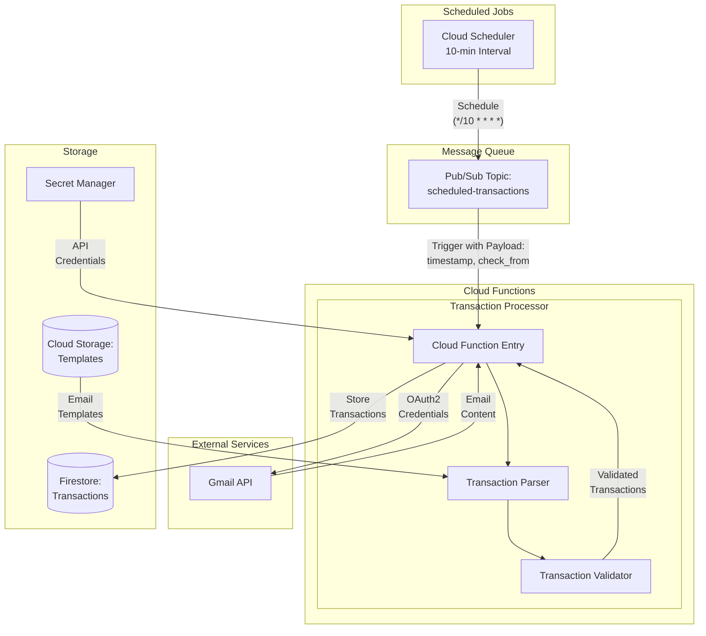
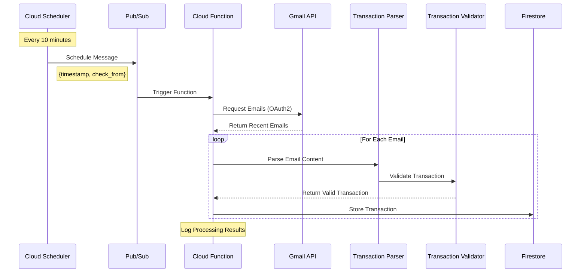

# Financial Tracker Architecture

## Overview

This document describes the architecture of the Financial Transaction Tracker, a serverless application that automatically processes financial transaction emails using Google Cloud Platform services.

## Diagram Guide

> **Note**: This document uses Mermaid diagrams. To view them:
> - **GitHub**: Diagrams render automatically
> - **VS Code**: Install "Markdown Preview Mermaid Support" extension
> - **Online**: Use [Mermaid Live Editor](https://mermaid.live)
>
> All diagrams are enclosed in ```mermaid code blocks.

## System Architecture

### High-Level Overview



### Processing Flow



## Component Details

### Scheduling & Messaging

#### Cloud Scheduler
- **Schedule**: Every 10 minutes (`*/10 * * * *`)
- **Timezone**: America/Chicago
- **Retry Configuration**:
  - Attempts: 3
  - Interval: 5 minutes
  - Timeout: 9 minutes

#### Cloud Pub/Sub
- **Topic**: `scheduled-transactions`
- **Message Format**:
  ```json
  {
    "timestamp": "current time",
    "check_from": "24 hours ago",
    "force_sync": true
  }
  ```

### Processing

#### Cloud Function
- **Name**: `transaction-processor`
- **Trigger**: Pub/Sub messages
- **Scope**: Last 24 hours of emails
- **Specifications**:
  - Runtime: Python 3.10
  - Memory: Configurable via config.yaml (default: 512MB)
  - Timeout: 540s (9 minutes)

### Storage Systems

#### Firestore Database
- Processed transactions
- Transaction categories
- Template mappings
- Email API IDs

#### Cloud Storage
- Email parsing templates
- Configuration files

#### Secret Manager
- Gmail API credentials
- Encryption keys

## Security Architecture

### Authentication
- OAuth 2.0 for Gmail API
- Service account for GCP services

### Authorization
- IAM roles for service accounts
- Encrypted credentials storage

### Data Protection
- At-rest encryption for storage
- In-transit encryption for APIs
- Secure key management

## Future Enhancements

### Additional Services

1. **Transaction API**
   - HTTP endpoints
   - CRUD operations
   - Search capabilities
   - User preferences

2. **OAuth Handler**
   - OAuth flow management
   - Token refresh
   - User authentication

### Infrastructure

1. **Deployment**
   - Multi-environment setup
   - Traffic splitting
   - Automated pipelines

2. **Monitoring**
   - Error tracking
   - Performance metrics
   - Usage analytics

3. **Optimization**
   - Resource usage
   - Caching
   - Batch processing
   - Enhanced Pub/Sub with DLQ 

## Component Details

### Email Processing

#### Email API ID System
- Unique identifier tracking
- Duplicate detection
- Processing history
- Cross-reference capabilities

#### Template System
- Pattern-based matching
- Dynamic field extraction
- Validation rules
- Mock template generation

### Testing Infrastructure

#### Mock Data Generation
- Template-based mock emails
- Synthetic transaction data
- Failure case simulation
- API response mocking

#### Testing Framework
- Unit test suite
- Integration tests
- Template validation
- Mock data verification

### Deployment Pipeline

#### Cloud Deployment
- Automated deployment process
- Environment configuration
- Cloud service linking
- Credential management
- Version control integration 